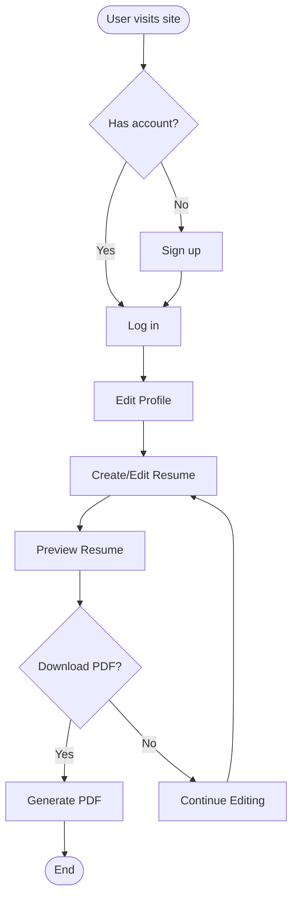
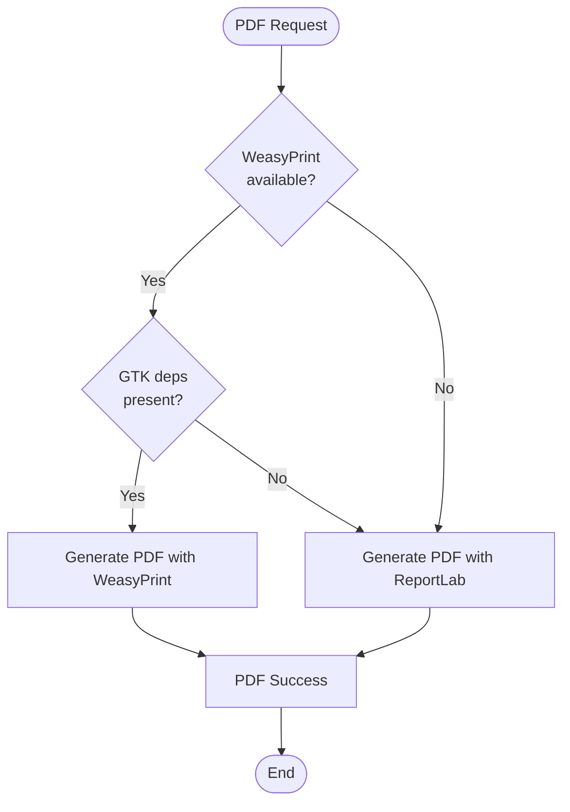

# 📄 AI Resume Builder

[](https://www.python.org/)
[](https://www.djangoproject.com/)
[](https://cloudinary.com/)
[](https://doc.courtbouillon.org/weasyprint/stable/)
[](LICENSE)

---

## 📌 Quick Summary

**AI Resume Builder** is a full‑featured, production‑ready Django web application for creating, managing, and downloading professional resumes and cover letters. It offers user authentication, multiple customizable templates, portfolio generation, and robust PDF export (with a seamless fallback from WeasyPrint to ReportLab for Windows users). The project integrates Cloudinary for scalable media storage and SMTP for email notifications, making it suitable for both individual use and as a foundation for larger career‑platform projects.

---

## 📖 Project Overview

AI Resume Builder empowers users to build and manage their professional profiles, create polished resumes from a variety of templates, and generate matching cover letters. It handles everything from user registration and profile management to the final PDF download, with a focus on flexibility and ease of use.

### 🎯 Target Users
- **Job Seekers** looking to create and maintain multiple resume versions.
- **Career Coaches** who need to assist clients with resume formatting.
- **Developers** seeking a well-structured Django project with advanced features like custom PDF generation and cloud media storage.

### 🔑 Key Benefits
- **Multiple Templates** – Choose from modern, classic, creative, minimal, executive, and technical designs.
- **Reliable PDF Export** – Uses WeasyPrint for high‑fidelity HTML to PDF conversion, with an automatic fallback to ReportLab on Windows systems where WeasyPrint dependencies are complex.
- **Cloud Media Storage** – Integrated with Cloudinary for efficient handling of profile photos, project thumbnails, and uploaded files.
- **User‑Friendly** – Clean, responsive interface with intuitive forms and profile management.
- **Extensible** – Modular codebase (separate `users` and `resume` apps) that's easy to customize.

---

## ✨ Core Features

- **User Authentication**: Sign up, log in, log out, password reset, and profile management with country and phone code selection.
- **Resume Creation**: Build resumes using one of six built‑in templates (modern, classic, creative, minimal, executive, technical).
- **Cover Letters**: Generate and manage professional cover letters tailored to specific jobs.
- **Portfolio Generation**: Create and download a portfolio of projects to accompany your resume.
- **PDF Export**:
  - **Primary**: WeasyPrint for perfect HTML/CSS to PDF rendering (requires GTK on Linux/macOS).
  - **Fallback**: ReportLab automatically used on Windows if WeasyPrint dependencies are missing, ensuring functionality everywhere.
- **Cloudinary Integration**: Profile photos and other media are stored and served via Cloudinary for scalability and performance.
- **Email Notifications**: SMTP integration for account verification and user alerts.
- **Admin Panel**: Full Django admin customization for managing users, resumes, and site content.
- **Responsive UI**: Modern, mobile‑friendly interface built with Bootstrap.

---

## 🛠️ Technology Stack

| Layer                | Technologies                                                                 |
|----------------------|------------------------------------------------------------------------------|
| **Backend**          | Python 3.12, Django 4.2+                                                     |
| **Database**         | SQLite (default), PostgreSQL/MySQL configurable via `DATABASE_URL`           |
| **Media Storage**    | Local (development) or Cloudinary (production)                               |
| **PDF Generation**   | WeasyPrint (preferred), ReportLab (fallback)                                 |
| **Frontend**         | Django Templates, HTML5, CSS3, JavaScript, Bootstrap                         |
| **Forms**            | django‑crispy‑forms                                                          |
| **Email**            | SMTP (configured via environment variables)                                  |
| **Utilities**        | Custom country/phone code data, reusable PDF utilities                       |
| **Deployment**       | Gunicorn, Nginx, Docker (optional), compatible with Heroku/AWS               |

---

## 🏗 System Architecture

The following diagram illustrates the high‑level architecture of the AI Resume Builder application, showing how the different components interact.

```mermaid
graph TB
    subgraph Client
        Browser[Web Browser]
    end

    subgraph Server
        Django[Django Application]
        subgraph Apps
            Users[users App]
            Resume[resume App]
        end
        Views[Views]
        Models[(Database)]
    end

    subgraph External Services
        Cloudinary[Cloudinary Media Storage]
        SMTP[SMTP Server]
    end

    subgraph PDF Engine
        WeasyPrint[WeasyPrint]
        ReportLab[ReportLab]
    end

    Browser --> Django
    Django --> Users
    Django --> Resume
    Users --> Models
    Resume --> Models
    Resume --> PDF Engine
    Django --> Cloudinary
    Django --> SMTP
```

**Explanation:**
- The user interacts with the Django application through a web browser.
- The application is split into two main apps: `users` (handles authentication and profiles) and `resume` (handles resumes, cover letters, portfolios).
- Data is stored in a database (SQLite by default, PostgreSQL in production).
- Media files (profile photos, thumbnails) are stored in Cloudinary.
- Email notifications are sent via an SMTP server.
- When a user downloads a PDF, the `resume` app calls the PDF engine, which first attempts WeasyPrint and falls back to ReportLab if necessary.

---

## 🔄 Workflow: User Journey

This flowchart shows the typical path a user takes through the application.



**Steps:**
1. User visits the site and either signs up or logs in.
2. After login, they can edit their profile (add photo, phone, country).
3. They create or edit a resume, choosing from various templates.
4. They can preview the resume and, if satisfied, download it as a PDF.
5. The PDF is generated using the dual‑engine fallback system.

---

## 📄 PDF Generation Decision Flow

The following diagram explains the logic behind the PDF generation fallback mechanism.



**Explanation:**
- When a PDF is requested, the system first checks if WeasyPrint is installed.
- If WeasyPrint is available, it then checks if the necessary GTK libraries are present (common issue on Windows).
- If both conditions are met, WeasyPrint generates a high‑quality PDF.
- If either condition fails, the system gracefully falls back to ReportLab, which works on all platforms without extra dependencies.

---

## 📁 Project Structure

```
ai-resume-builder/
├── manage.py                  # Django CLI
├── requirements.txt           # Python dependencies
├── db.sqlite3                 # Default SQLite database
├── core/                      # Project settings, URLs, WSGI/ASGI
│   ├── settings.py
│   ├── urls.py
│   └── ...
├── users/                     # Custom user model & authentication
│   ├── models.py
│   ├── forms.py
│   ├── login_views.py
│   └── ...
├── resume/                    # Main app: resume/cover letter logic
│   ├── models.py
│   ├── views.py
│   ├── utils.py               # PDF generation (WeasyPrint/ReportLab)
│   ├── countries_data.py       # Country list & phone codes
│   └── ...
├── templates/                 # HTML templates
│   ├── base.html
│   ├── resume/
│   │   ├── profile_edit.html  # Phone code widget
│   │   └── ...
│   └── ...
├── static/                    # Source static files (CSS, JS, images)
├── staticfiles/               # Collected static files (production)
├── media/                     # Local media uploads (dev)
└── scripts/                   # Utility scripts
```

---

## ⚙️ Installation & Setup

### Prerequisites
- Python 3.12+
- pip
- Git (optional)
- For WeasyPrint on Linux/macOS: GTK libraries (see [WeasyPrint Installation](https://doc.courtbouillon.org/weasyprint/stable/first_steps.html))

### Step 1: Clone Repository
```bash
git clone https://github.com/themanishpndt/AI-Resume-Builder.git
cd ai-resume-builder
```

### Step 2: Create Virtual Environment
**Windows PowerShell**
```powershell
python -m venv .venv
.\.venv\Scripts\Activate.ps1
```
**macOS / Linux**
```bash
python3 -m venv .venv
source .venv/bin/activate
```

### Step 3: Install Dependencies
```bash
pip install --upgrade pip
pip install -r requirements.txt
```

### Step 4: Configure Environment Variables
Create a `.env` file in the project root (or set system environment variables):
```env
SECRET_KEY=your-strong-secret-key
DEBUG=True
ALLOWED_HOSTS=127.0.0.1,localhost
DATABASE_URL=sqlite:///db.sqlite3
# Cloudinary (optional in development)
CLOUDINARY_URL=cloudinary://<api_key>:<api_secret>@<cloud_name>
# Email settings
EMAIL_HOST=smtp.gmail.com
EMAIL_PORT=587
EMAIL_HOST_USER=your-email@gmail.com
EMAIL_HOST_PASSWORD=your-app-password
EMAIL_USE_TLS=True
```

### Step 5: Database Migrations
```bash
python manage.py migrate
```

### Step 6: Create Superuser
```bash
python manage.py createsuperuser
```

### Step 7: Run Development Server
```bash
python manage.py runserver
```

Open `http://127.0.0.1:8000/` to access the application.

---

## 🔧 Configuration Details

### Settings (`core/settings.py`)
- **Database**: Defaults to SQLite. To use PostgreSQL, set `DATABASE_URL` (requires `dj-database-url`).
- **Cloudinary**: If `CLOUDINARY_URL` is present, media uploads are routed to Cloudinary; otherwise, local `media/` is used.
- **Email**: SMTP settings read from environment variables.
- **Static Files**: Use `python manage.py collectstatic` for production.

### Cloudinary Setup
1. Sign up at [Cloudinary](https://cloudinary.com/).
2. Find your `CLOUDINARY_URL` in the dashboard.
3. Add it to your `.env` file. Media uploads will automatically use Cloudinary.

### PDF Fallback Mechanism
The file `resume/utils.py` contains:
- `generate_pdf_from_html()` – attempts WeasyPrint.
- `generate_pdf_with_reportlab()` – fallback function.

---

## 🌐 API & Routes (Summary)

| URL Pattern                | Description                          | Auth Required |
|----------------------------|--------------------------------------|---------------|
| `/`                        | Home page / dashboard                | No            |
| `/signup/`                 | User registration                    | No            |
| `/login/`                  | Login                                | No            |
| `/logout/`                 | Logout                               | Yes           |
| `/profile/`                | View/edit profile                    | Yes           |
| `/resume/create/`          | Create a new resume                  | Yes           |
| `/resume/<id>/`            | View resume                          | Yes (owner)   |
| `/resume/<id>/download/`   | Download resume as PDF               | Yes (owner)   |
| `/cover-letter/`           | Manage cover letters                 | Yes           |
| `/portfolio/`              | Manage portfolio projects            | Yes           |
| `/admin/`                  | Django admin panel                    | Superuser     |

---

## 🧪 Testing

Run the test suite with:
```bash
python manage.py test
```

Tests cover:
- User authentication flows.
- Resume creation and validation.
- PDF generation functions (with mocked dependencies).
- Profile editing, including phone code selection.

---

## 🚀 Deployment

### Production-Ready Steps
1. **Set `DEBUG=False`** and a strong `SECRET_KEY` in environment.
2. **Configure a production database** (e.g., PostgreSQL) via `DATABASE_URL`.
3. **Set up Cloudinary** for media storage.
4. **Collect static files**:
   ```bash
   python manage.py collectstatic --noinput
   ```
5. **Serve with Gunicorn** (or similar) behind Nginx.
6. **Enable HTTPS** (SSL/TLS).

### Example Gunicorn Command
```bash
gunicorn core.wsgi:application --bind 0.0.0.0:8000 --workers 4
```

### Docker Deployment (Optional)
A `Dockerfile` and `docker-compose.yml` can be added for containerized deployment.

---

## 📈 Future Enhancements

- [ ] **Additional Resume Templates** – More modern designs.
- [ ] **AI‑Powered Suggestions** – Use LLMs to improve resume content.
- [ ] **Export to DOCX** – Support for Microsoft Word format.
- [ ] **Multi‑Language Support** – Internationalize the interface.
- [ ] **Social Login** – OAuth with Google/LinkedIn.
- [ ] **Analytics Dashboard** – Track resume views/downloads.

---

## 📜 Limitations

- **WeasyPrint on Windows**: Requires manual GTK installation for full functionality; otherwise, ReportLab fallback is used (ReportLab has limited CSS support).
- **Email Sending**: Requires valid SMTP credentials; in development, emails are printed to console if no SMTP is configured.

---

## 🤝 Contributing

Contributions are welcome! Please follow these steps:

1. Fork the repository.
2. Create a feature branch: `git checkout -b feature/your-feature`
3. Commit changes: `git commit -m 'Add your feature'`
4. Push to branch: `git push origin feature/your-feature`
5. Open a Pull Request.

### Guidelines
- Follow PEP8 coding standards.
- Write tests for new functionality.
- Update documentation as needed.

---

## 📄 License

This project is open‑source and available under the **MIT License**. See the [LICENSE](LICENSE) file for details.

---

## 👨‍💻 Author

**Manish Sharma**  
📍 Ghaziabad, Uttar Pradesh, India  
📞 +91 7982682852  
📧 [manishsharma93155@gmail.com](mailto:manishsharma93155@gmail.com)  
🔗 [LinkedIn](https://www.linkedin.com/in/themanishpndt)  
💻 [GitHub](https://github.com/themanishpndt)  
🌐 [Portfolio](https://themanishpndt.github.io/Portfolio/)

---

If you find this project helpful, please ⭐ it on [GitHub](https://github.com/themanishpndt/AI-Resume-Builder)! 🙌